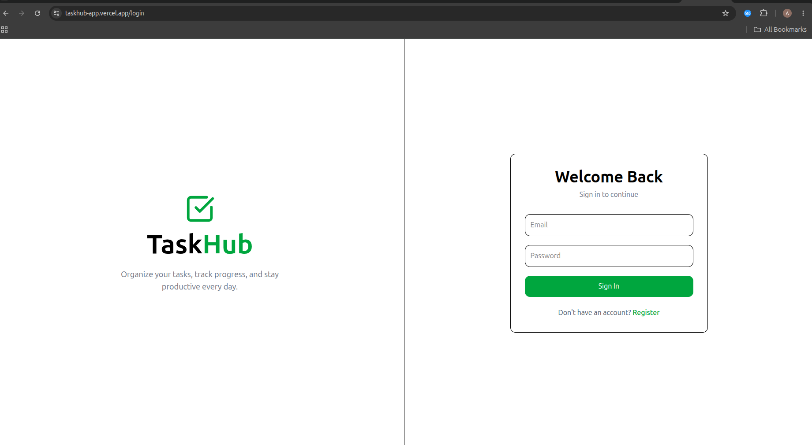
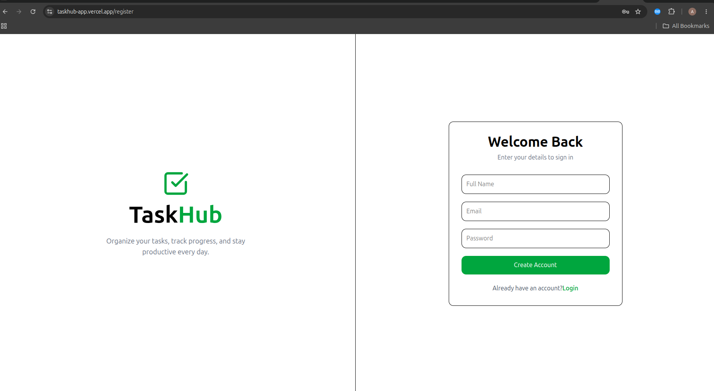
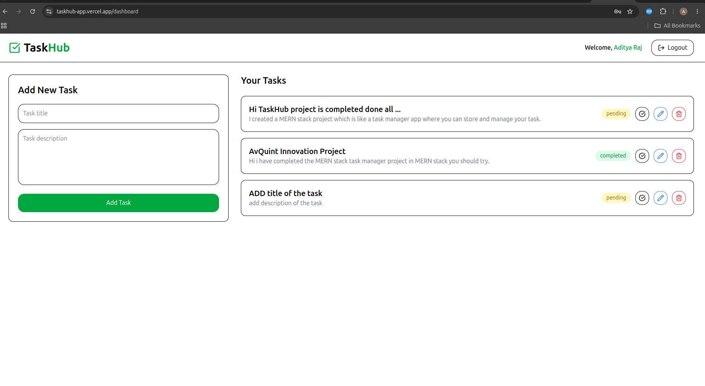
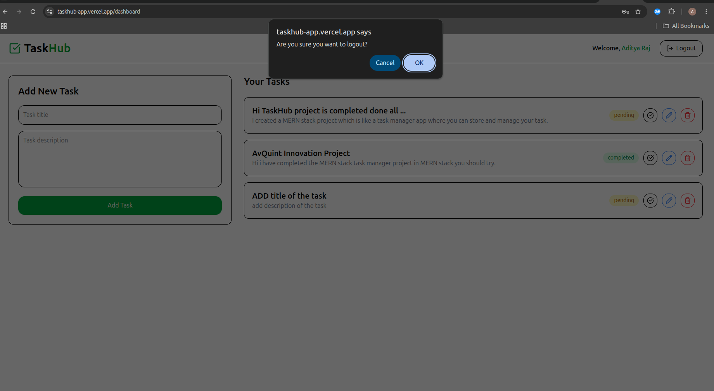

# TaskHub – Task Management Web Application

A full-stack Task Management Web Application built using the MERN Stack (MongoDB, Express.js, React.js, Node.js) as part of the MERN Stack Internship Assignment.

## Live Demo

Frontend (Vercel): <https://taskhub-app.vercel.app>

Backend (Render): [[Backend URL](https://mern-assignment-9ivp.onrender.com)]

GitHub Repository: <https://github.com/Aditya987456/mern-assignment>

---

## Project Overview

TaskHub is a secure task management application that allows users to:

* Register and Login using JWT Authentication
* Create Tasks
* View Tasks
* Update Tasks
* Delete Tasks
* Mark Tasks as Pending or Completed
* Access protected routes securely
* Manage personal tasks independently

---

## Features

### Authentication

* User Registration
* User Login
* Password Hashing using bcrypt
* JWT Token Authentication
* Protected Routes using Middleware

### Task Management

* Create New Tasks
* View All Tasks
* Update Existing Tasks
* Delete Tasks
* Toggle Task Status (Pending / Completed)

### Frontend

* Responsive User Interface
* React Functional Components
* React Router DOM
* Axios API Integration
* Toast Notifications using React Hot Toast

### Backend

* RESTful APIs
* JWT Authentication
* Input Validation using Zod
* Error Handling
* MongoDB Integration with Mongoose

---

## Tech Stack

### Frontend

* React.js
* Vite
* Tailwind CSS
* Axios
* React Router DOM
* React Hot Toast
* Lucide React

### Backend

* Node.js
* Express.js
* MongoDB
* Mongoose
* JWT
* bcrypt
* Zod

### Deployment

* Frontend: Vercel
* Backend: Render
* Database: MongoDB Atlas

---

## Folder Structure

mern-assignment/

├── frontend/

│ ├── src/

│ ├── components/

│ ├── pages/

│ ├── utils/

│ └── ...

│

├── backend/

│ ├── routes/

│ ├── middleware/

│ ├── models/

│ ├── config/

│ └── ...

│

└── README.md

---

## API Endpoints

### Authentication

#### Register User

POST /api/user/register

#### Login User

POST /api/user/login

---

### Tasks

#### Create Task

POST /api/task/create

#### Get All Tasks

GET /api/task/get

#### Update Task

PUT /api/task/update/:id

#### Toggle Task Status

PATCH /api/task/:id/status

#### Delete Task

DELETE /api/task/delete/:id

---

## Environment Variables

### Backend (.env)

MONGODB_URL=your_mongodb_connection_string

JWT_SECRET=your_jwt_secret

PORT=5000

### Frontend (.env)

VITE_BACKEND_URL=your_backend_url

---

 
 

## Installation & Setup

### Clone Repository

git clone <https://github.com/Aditya987456/mern-assignment>

cd mern-assignment

---

### Backend Setup

cd backend

npm install

Create .env file and add:

MONGODB_URL=your_mongodb_connection_string

JWT_SECRET=your_jwt_secret

PORT=5000

Run Backend:

npm run dev

---

### Frontend Setup

cd frontend

npm install

Create .env file and add:

VITE_BACKEND_URL=http://localhost:3000

Run Frontend:

npm run dev

---

## Screenshots

### Login Page

### Register Page

### Dashboard

### Task Addition

### Logout Confirmation

---

## Security Measures

* Password Hashing using bcrypt
* JWT Authentication
* Protected Routes
* Zod Validation
* Input Sanitization
* Proper HTTP Status Codes
* Error Handling

---

 
 

## Author

Aditya Raj

Email: [adityarajxdev@gmail.com](mailto:adityarajxdev@gmail.com)

GitHub: [https://github.com/Aditya987456/]

LinkedIn: [https://www.linkedin.com/in/adityaraj2981/]
